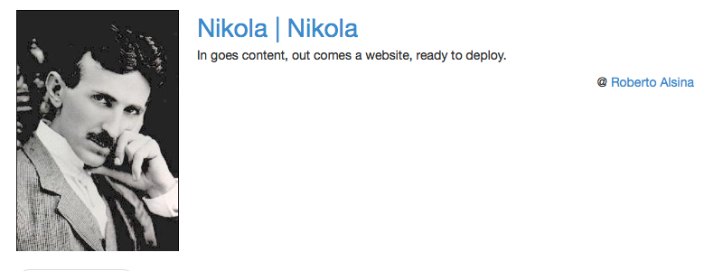

Plugin to embed link, just like the link to Facebook or Google Plus.

Usage::

    .. link_figure:: url
	    :title:
	    :description:
	    :class:
	    :image_url:
	    :author:
	    :author_url:
	    :author_by:

This should embed the link, with title, description and image.

### Examples

This reStructuredText document:

```ReST

    .. link_figure:: http://getnikola.com/
        :title: Nikola | Nikola
        :description: In goes content, out comes a website, ready to deploy.
        :class: link-figure
        :image_url: http://getnikola.com/galleries/demo/tesla2_lg.jpg
        :author: Roberto Alsina
        :author_url: http://ralsina.me/
        :author_by: by
```

will result in:

```html

    <div class="link-figure">
	    <div class="link-figure-media">
		    <a class="link-figure-image" href="http://getnikola.com/" target="_blank">
		    	
		    </a>
	    </div>
	    <div class="link-figure-content">
		    <a class="link-figure-title" href="http://getnikola.com/" target="_blank">Nikola | Nikola</a>
		    <p class="link-figure-description">In goes content, out comes a website, ready to deploy.</p>
		    <p class="link-figure-author">by <a href="http://ralsina.me/" target="_blank">Roberto Alsina</a></p>
	    </div>
	</div>
```

Screenshot: 

