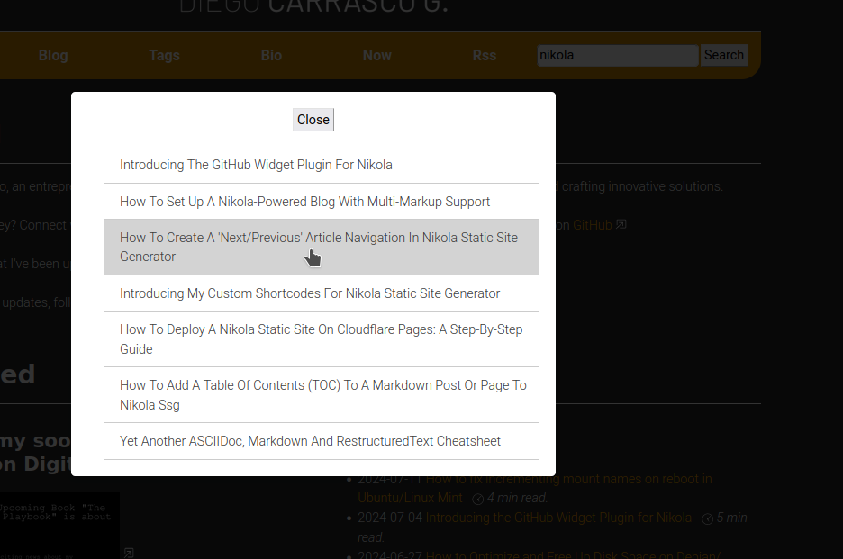

# flexsearch_plugin

This plugin adds search functionality to a Nikola static site. It generates a JSON file with posts, pages, and their metadata, then uses [flexsearch](https://github.com/nextapps-de/flexsearch) for fast client-side search.

## Updates

You can get the last updates in my [blog](https://diegocarrasco.com/project-nikola-flexsearch-plugin), or regularly checking here.

### v0.2

- Check the CHANGELOG.md (new file in the repo) for a summary of the changes. 
- NOTE: I hope I didn't forget to document anything.

### v0.1

- Initial version.

## Features

- Fast client-side searching with FlexSearch
- Configurable indexing of posts and/or pages
- Support for both overlay and inline search results display
- Displays content type (post/page) in search results
- Search across titles, content, and tags
- Keyboard navigation (ESC to close overlay, Enter to search)
- Analytics tracking via UTM parameters (just a `?utm_source=internal_search` appended to the url in the results)

## Installation

To install the plugin, use the Nikola plugin installation command:

```shell
nikola plugin -i flexsearch_plugin
```

**IMPORTANT**
Version 0.2 has `FLEXSEARCH_INDEX_PAGES = False` by default to maintain the default search behaviour of the previous version.

## Configuration

In your `conf.py` file, you can configure the following options:

```python
# Content indexing options
FLEXSEARCH_INDEX_POSTS = True   # Index posts (default: True)
FLEXSEARCH_INDEX_PAGES = False  # Index pages (default: False) 
FLEXSEARCH_INDEX_DRAFTS = False # Index draft content (default: False)
```

There are two provided search implementations that you can use:

1. **FLEXSEARCH_EXTEND**: A simpler implementation that adds search results to a div (default)
2. **FLEXSEARCH_OVERLAY**: A more advanced implementation with overlay display (the one I use in https://diegocarrasco.com)

Add one of these to your `BODY_END` in `conf.py`:

```python
# Add the search script to your BODY_END
BODY_END = BODY_END + FLEXSEARCH_EXTEND  # Or use FLEXSEARCH_OVERLAY
```

## How to Use

There are 2 options for displaying search results:

Here is an example of the overlay:



### Option 1: Inline Search Results

Add this HTML where you want the search box to appear:

```html
<input type="text" id="search_input" placeholder="Search...">
<button id="search_button">Search</button>
<div id="search_results"></div>
```

This will display search results directly in the `search_results` div.

### Option 2: Overlay Search Results

Add this HTML where you want the search box to appear:

```html
<input type="text" id="search_input" placeholder="Search...">
<button id="search_button">Search</button>

<div id="search_overlay">
    <div id="search_content">
        <div id="search_header">
            <h3>Search Results</h3>
            <button class="close-button" onclick="closeSearch()">×</button>
        </div>
        <div id="search_results"></div>
    </div>
</div>
```

This will display search results in a modal overlay that appears when search is triggered.

## CSS Styling

Add this CSS to your site's stylesheet for proper styling of the search overlay:

```css
/* Basic overlay structure */
#search_overlay {
    position: fixed;
    width: 100%;
    height: 100%;
    top: 0;
    left: 0;
    background: rgba(0, 0, 0, 0.8);
    z-index: 1000;
    display: none;
    justify-content: center;
    align-items: flex-start;
    overflow-y: auto;
    padding: 20px;
    box-sizing: border-box;
}

#search_content {
    background: white;
    width: 90%;
    max-width: 800px;
    border-radius: 8px;
    box-shadow: 0 4px 15px rgba(0,0,0,0.2);
    max-height: 85vh;
    overflow-y: auto;
    display: flex;
    flex-direction: column;
    margin-top: 40px;
}

/* Header */
#search_header {
    display: flex;
    justify-content: space-between;
    align-items: center;
    padding: 15px 20px;
    border-bottom: 1px solid #eee;
    position: sticky;
    top: 0;
    z-index: 5;
}

.search-title {
    font-size: 1.3rem;
    font-weight: bold;
}

.close-button {
    background: none;
    border: none;
    font-size: 1.5rem;
    cursor: pointer;
    padding: 0;
    width: 30px;
    height: 30px;
    display: flex;
    align-items: center;
    justify-content: center;
    border-radius: 50%;
    background: lightgray;
}

.close-button:hover {
    background-color: #f0f0f0;
}

/* Results area */
#search_results {
    padding: 10px 20px;
    flex: 1;
    overflow-y: auto;
}

/* Type badge styling */
.badge {
    display: inline-block;
    padding: 2px 6px;
    border-radius: 4px;
    font-size: 0.7rem;
    background-color: #e9ecef;
    color: #495057;
    margin-right: 8px;
    vertical-align: middle;
    text-transform: uppercase;
    letter-spacing: 0.5px;
}

/* Mobile responsiveness */
@media (max-width: 576px) {
    #search_content {
        width: 95%;
        margin-top: 20px;
        max-height: 90vh;
    }
    
    a {
        text-wrap: auto !important;
    }
}
```

For the complete CSS with additional styling options, see the included file `flexsearch.css`.

## How It Works

1. The plugin generates a `search_index.json` file in your site's output directory
2. The JSON file contains all your posts and/or pages with their metadata
3. When a user searches, the FlexSearch library searches through this JSON
4. Results are displayed either inline or in an overlay

## Troubleshooting

If search isn't working:

1. Check your browser console for JavaScript errors
2. Verify that `search_index.json` exists in your site's output directory
3. Make sure HTML elements have the correct IDs (`search_input`, `search_button`, `search_results`)
4. Check the network tab in developer tools to ensure the JSON file loads correctly

## License

This plugin is under the MIT License.

Copyright (c) [2024] [Diego Carrasco G.]

Permission is hereby granted, free of charge, to any person obtaining a copy
of this software and associated documentation files (the "Software"), to deal
in the Software without restriction, including without limitation the rights
to use, copy, modify, merge, publish, distribute, sublicense, and/or sell
copies of the Software, and to permit persons to whom the Software is
furnished to do so, subject to the following conditions:

The above copyright notice and this permission notice shall be included in all
copies or substantial portions of the Software.

THE SOFTWARE IS PROVIDED "AS IS", WITHOUT WARRANTY OF ANY KIND, EXPRESS OR
IMPLIED, INCLUDING BUT NOT LIMITED TO THE WARRANTIES OF MERCHANTABILITY,
FITNESS FOR A PARTICULAR PURPOSE AND NONINFRINGEMENT. IN NO EVENT SHALL THE
AUTHORS OR COPYRIGHT HOLDERS BE LIABLE FOR ANY CLAIM, DAMAGES OR OTHER
LIABILITY, WHETHER IN AN ACTION OF CONTRACT, TORT OR OTHERWISE, ARISING FROM,
OUT OF OR IN CONNECTION WITH THE SOFTWARE OR THE USE OR OTHER DEALINGS IN THE
SOFTWARE.