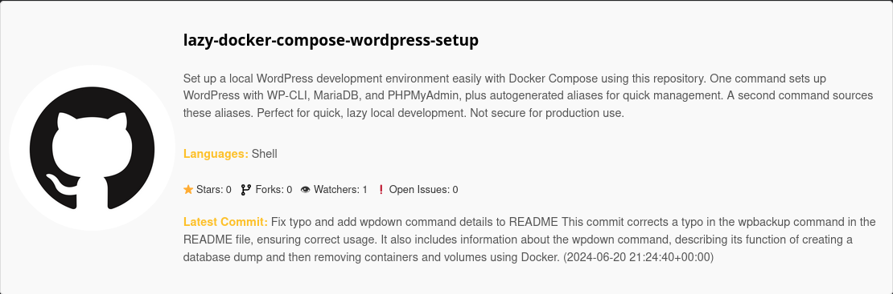
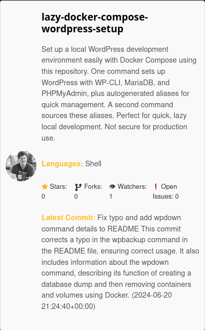
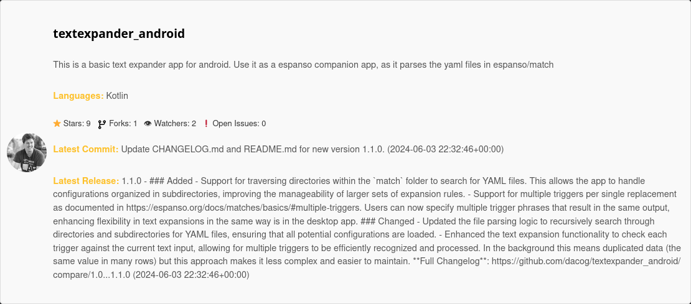

# GitHub Widget Plugin for Nikola

This is a Nikola plugin that allows you to embed a GitHub repository widget in your Nikola-generated site. The widget displays repository details, including the description, languages, stars, forks, watchers, open issues, and latest activity (commits and releases). You can also customize the widget to show the repository owner's avatar or the default GitHub logo.

## Installation

```shell
nikola plugin -i github_widget
```

## Update conf.py (optional)

Optionally you can add an access token to your config. This is optional.

Without a token you can still use the shortcode, but you will get api rate limit errors if you use it too much.

# Add your GitHub API token here

The token should have repository -> Contents -> read-only permissions.

```python
GITHUB_API_TOKEN = 'your_github_api_token_here'
```

## Use the shortcode

here are some examples:

```markdown
// Shortcode Example 1
{}dacog/lazy-docker-compose-wordpress-setup{}

// Shortcode Example 2
{}dacog/lazy-docker-compose-wordpress-setup{}

// Shortcode Example 3
{}dacog/textexpander_android{}
```

Which gives these widgets:

**Shortcode Example 1**



**Shortcode Example 2**



**Shortcode Example 3**



## CSS

Here is a sample CSS wich results in the examples above.

```css
/* github shortcode */
.github-widget {
    display: flex;
    align-items: center;
    border: 1px solid #ddd;
    padding: 10px;
    margin: 10px 0;
    border-radius: 5px;
    background-color: #f9f9f9;
}

.github-widget-image {
    margin-right: 10px;
}

.github-widget img {
    border-radius: 50%;
}

.github-widget .repo-info {
    display: flex;
    flex-direction: column;
}

.github-widget .repo-info h3 {
    margin: 0;
    font-size: 1.2em;
}

.github-widget .repo-info p {
    margin: 5px 0;
    font-size: 0.9em;
    color: #555;
}

.github-widget .repo-info ul {
    list-style: none;
    padding: 0;
    display: flex;
    gap: 10px;
}

.github-widget .repo-info ul li {
    font-size: 0.8em;
    color: #333;
}

.github-widget h4 {
    color: black;
}
```

## License

this widget is under the MIT License

MIT License

Copyright (c) [2024] [Diego Carrasco G.]

Permission is hereby granted, free of charge, to any person obtaining a copy
of this software and associated documentation files (the "Software"), to deal
in the Software without restriction, including without limitation the rights
to use, copy, modify, merge, publish, distribute, sublicense, and/or sell
copies of the Software, and to permit persons to whom the Software is
furnished to do so, subject to the following conditions:

The above copyright notice and this permission notice shall be included in all
copies or substantial portions of the Software.

THE SOFTWARE IS PROVIDED "AS IS", WITHOUT WARRANTY OF ANY KIND, EXPRESS OR
IMPLIED, INCLUDING BUT NOT LIMITED TO THE WARRANTIES OF MERCHANTABILITY,
FITNESS FOR A PARTICULAR PURPOSE AND NONINFRINGEMENT. IN NO EVENT SHALL THE
AUTHORS OR COPYRIGHT HOLDERS BE LIABLE FOR ANY CLAIM, DAMAGES OR OTHER
LIABILITY, WHETHER IN AN ACTION OF CONTRACT, TORT OR OTHERWISE, ARISING FROM,
OUT OF OR IN CONNECTION WITH THE SOFTWARE OR THE USE OR OTHER DEALINGS IN THE
SOFTWARE.
